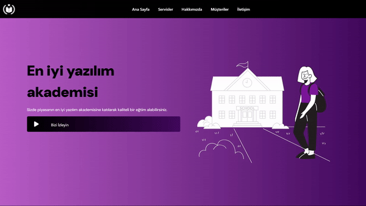
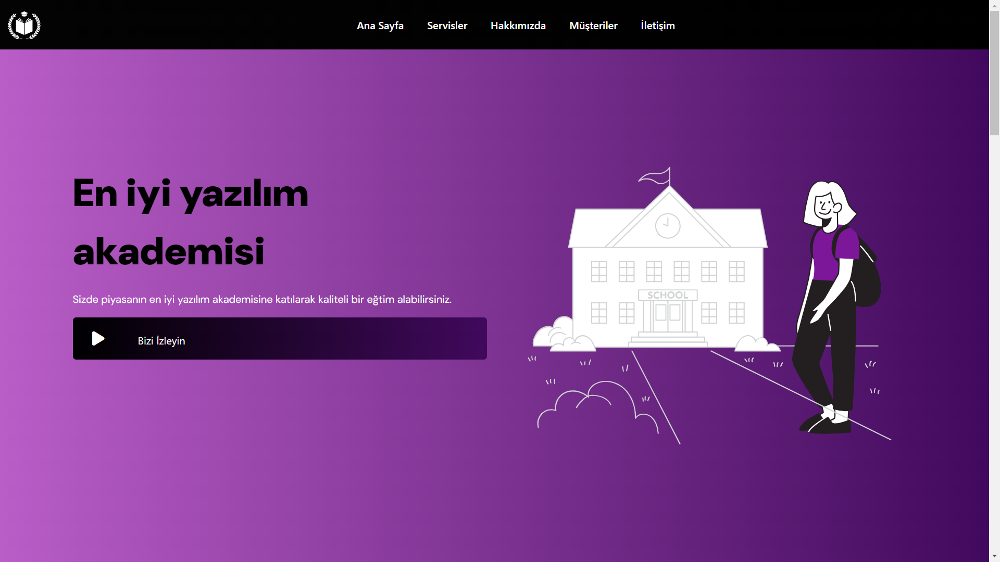
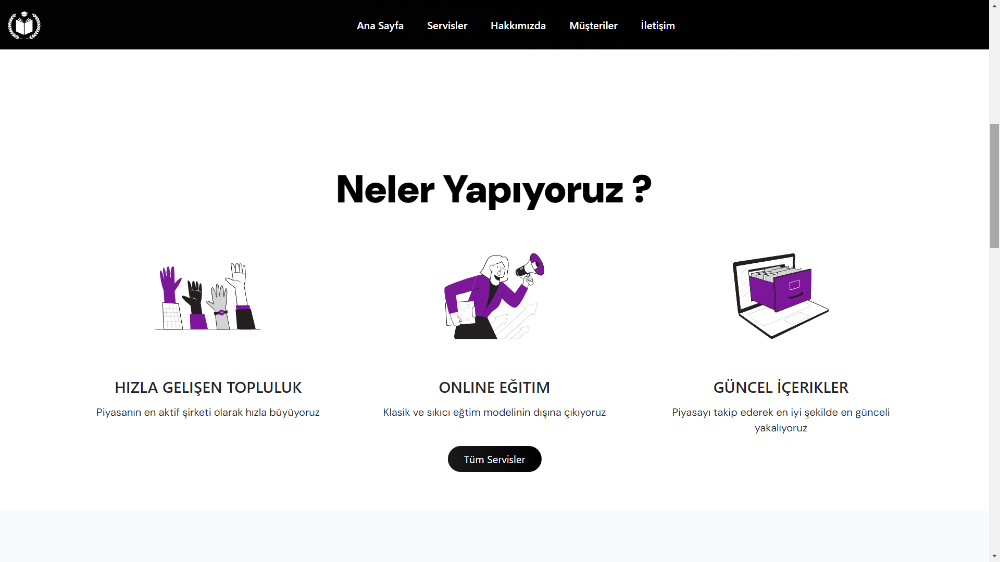
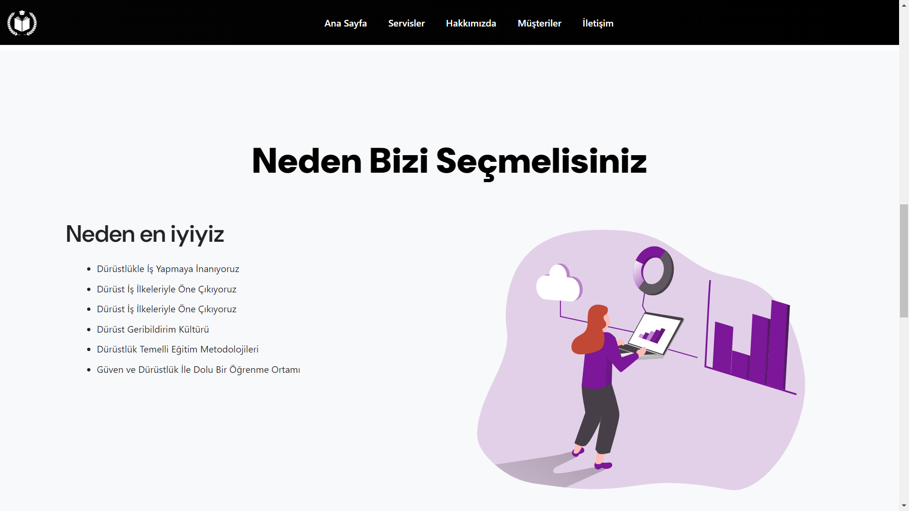
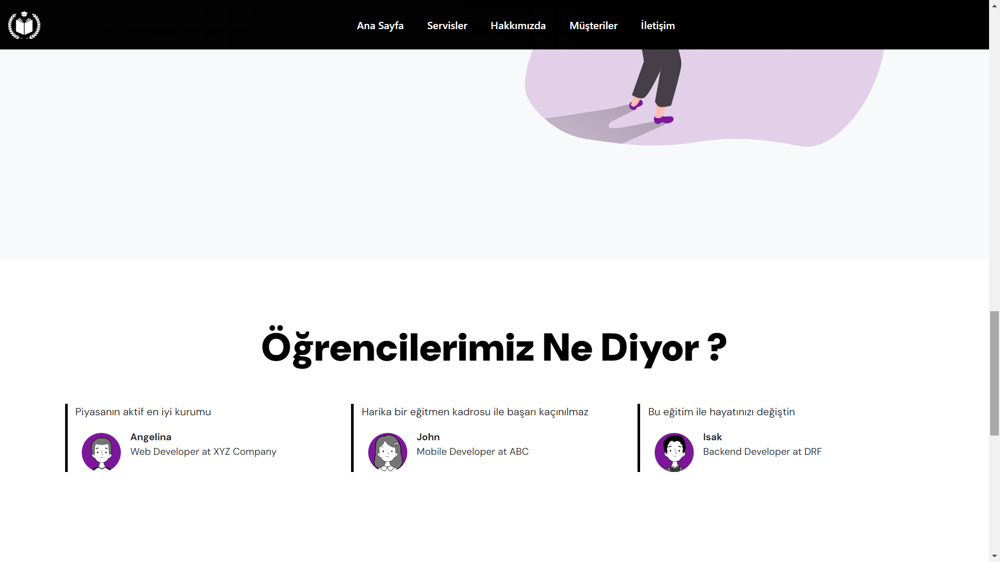
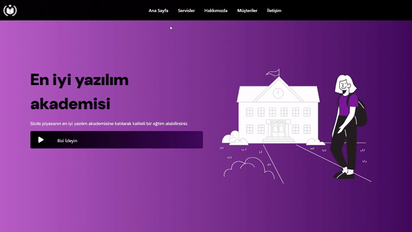
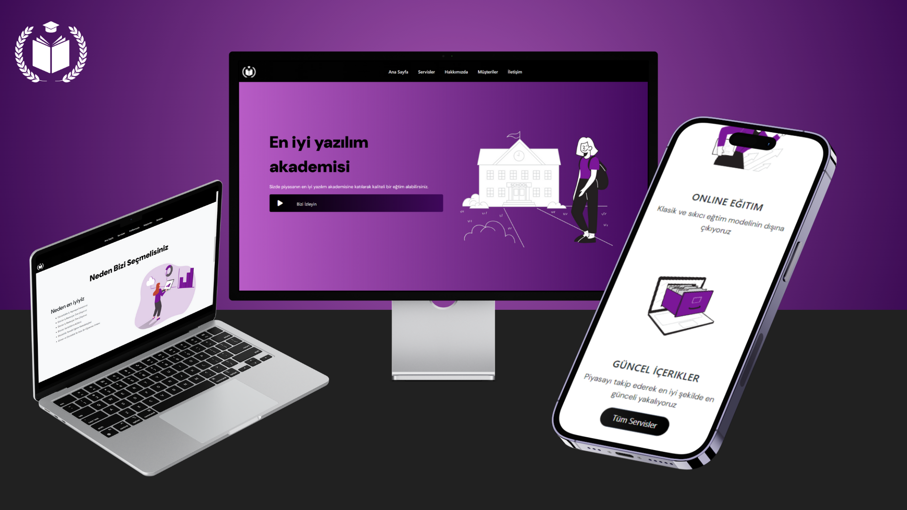

## Udemig Academy

**Başlık:** Academy

**Açıklama:** Bu web sitesi, bir proje ödevidir

Tek sayfadan oluşan bu web sitesi, mordan koyu mora geçişli bir renk paleti ile tasarlanmıştır. Bu renk paleti, sakin ve modern bir atmosfer oluşturmayı amaçlamaktadır.

**Logo:**

**Genel Görsel:**

**Temel Bilgiler:**

* **Tasarım:** Sitemiz responsive bir tasarıma sahip ve tek sayfadan oluşuyor.
* **Renk Paleti:** Genel renk, mor ile koyu mor arasında gradient geçişlidir ve siyah renk tamamlayıcı olarak kullanılmıştır.

* **Kullanılan Teknolojiler:**
    * HTML
    * CSS

**Genel Görsel:**
## Giriş Ekranı

## Hakkımızda

## Bizi Neden Seçmelisiniz

## Kullanıcı Yorumları

**Ek Özellikler:**

* Hover

 
 --
  .gif)
* Responsive
  
  

**Renkler:**

